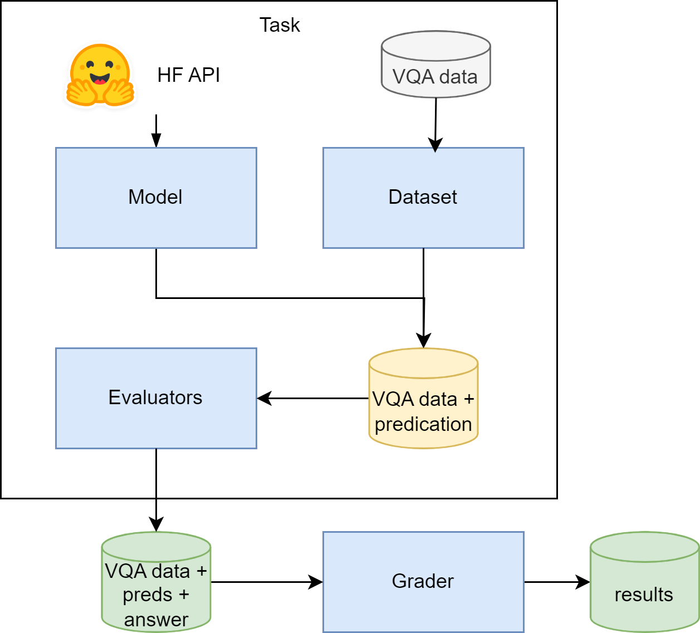

# Trust-Medical-LVLM

## Setup
### Folder structure completion 
1. create following directories
* `data`
* `log`
2. create a `.env` file and add enviroment variable need for API calles under

### Dataset downloading
1. mimic-cxr-jpg dataset
> you could download subj-set of the `mimic-cxr-jpg` that used in this evaluation process.`

### Model downloading
* Most of the model are downloaded from the `hugging-face` library, therefore setup huggingface CLI, following [this link](https://huggingface.co/docs/huggingface_hub/en/guides/cli)

### create conda env and instrall libraries
1. create conda env
```
conda create -n lvlm_safety_env python=3.10
```
2. library installation
```
pip install torch==2.4.1 torchvision==0.19.1 torchaudio==2.4.1 --index-url https://download.pytorch.org/whl/cu124

pip install -r requirements.txt
```


## Folder structure 
```
Trust-Medical-LVLM/
├── data/
│   ├── data/
│   ├── model/
├── src/
│   ├── datasets/
│   ├── evaluators/
│   ├── graders/
│   ├── methods/
│   ├── models/
│   ├── tasks/
│   ├── utils/
├── notebooks/
├── log/
├── scripts/
├── README.md
├── .env
├── .gitignore
└── requirements.txt
```

This is the folder structure for the Trust-Medical-LVLM project.

- `data/`: Contains data-related files and subdirectories.
    - `data/`: Subdirectory for storing raw data files such as CSVs, images, etc.
    - `model/`: Subdirectory for storing pre-trained models, checkpoints, and model outputs.

- `src/`: Contains source code for the project.
    - `configs/`: Config file for datasets and models .
    - `datasets/`: Dataset loading modules.
    - `evaluators/`: Output type post-processing modules, such as YesOrNoEvaluation, ChatBotEvaluation.
    - `graders/`: Generate scores based on post-processed asnwers.
    - `methods/`: Module to pre-process images.
    - `models/`: LVLM model chat interfaces.
    - `tasks/`: Pipelining answer generation, post-processing and generated dataframe saving.
    - `utils/`: Utility functions and helper scripts used throughout the project.

- `scripts/`: Contains python modules related to automate experiments
    - `run/`: Modules for QA feeding and answer evaluation
        -`fairness/`: All the experiment runner related to fairness evalautions
        -`privacy/`: All the experiment runners related to privacy evaluations
    - `score/`: Modules for generate performance scores on run results
        -`fairness/`: All the scoreing related to fairness evaluation
        -`privacy/`: All the scoreing related to privacy evaluation

- `notebooks/`: Jupyter notebooks for conducting experiments, visualizations, and analysis.
- `log/`: Directory for storing log files generated during training and evaluation.
- `scripts/`: Scripts for tasks such as data preprocessing, model training, and evaluation.
- `README.md`: The main README file providing an overview and instructions for the project.
- `.env`: File for storing environment variables required for the project.
- `.gitignore`: File specifying which files and directories to ignore in version control.
- `requirements.txt`: File listing all Python dependencies required to run the project.

## Operational flow

  


## Developer Guide

### Dataset building
- For each new dataset that we are introductin to the framework, we need to implement a module that is inherited from the `BaseDataset` class, with descriptive implementation of how dataset builds. Note: in the current implementation, we target on building dataset (including loading) at the `__init__` method
- define dataset variation under class variable `dataset_ids`.
- Then based on different _dataset-ids_ generate `ImageTxtSample` object in the formats that you defined in `template_format()` method


### Model building
- For each model that we are introducing into this framework, we need to implement a package called `<mode-name>_chat.py` as for the model calling interface
- in that package need to implement a python class that inherets from `BaseChat` class
- Where we need to implement the
```
@torch.no_grad()
def chat(self, messages: List, **generation_kwargs) -> Response:
```
 function with exact function signature. which take dictionary list under `message` and model generation hyper-paramter under `**generation_kwargs` parameter. 
- `MODEL_CONFIG` class parameter can be use to load/init different version of the same model

### Evaluators
- Like in other packages, as in here when you are implementing a new evaluator, that need to be inherited from the `BaseEvaluator` class. 
- you need to implement the `process()` function, with required function signature
```
def process(self, preds: Sequence[Any], labels: Optional[Sequence[Any]] = None, extras: Optional[Sequence[Any]] = None, **kwargs) -> Tuple[Sequence[Any], Sequence[Any], Sequence[Any]]:
```
- `preds` is the model generated response, `labels` is the ground truth, and `extras` is the additional data that the evaluator may need to evaluate the model response. 
- each new evaluator should have an unique ID. 

### Graders
- decouple the base metrics from the dataset connection in this framework, where base metrics will be implemented under `metrics.py` package and add to the __supported_metrics__ dictionary to create the method interface
- Build class to use build metrics to analysis the generated results in the run process, which usually outputs into a `.csv` file. and here each gradering method sould produce finalized results, not a intermediate result. 

### Methods
- The new method class you are introducing should be inherited from the `BaseMethod` class
- Where you need to implement, `run()` method with tight function signature
```
def run(self, data: _OutputType, **kwargs) -> _OutputType:
```

### Tasks
- When you are implementing a new task module, that need to be inherited from the `BaseTask` module, 
- Where you need to implement following function as for your task, 
```
def pipeline(self) -> None:
```
```
def generate(self, dataloader: DataLoader, **generate_kwargs) -> List[Dict[str, Any]]:
```
```
def eval(self, responses: List[Dict[str, Any]]) -> Dict[str, Union[float, Sequence]]:
```


